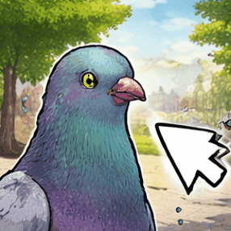

# Pigeon Shot 📷

A lightweight screenshot tool written in Rust using GTK4 and libadwaita.




## Features

- 🖼️ Full-screen screenshot capture
- 💾 Save to `~/Pictures/Screenshots/` directory
- 📋 Copy to clipboard support
- 🎨 Modern libadwaita UI
- ⚡ Fast and lightweight

## Building

### Requirements

- Rust 1.70+
- GTK 4 development files
- libadwaita development files

### Build

```bash
cargo build --release
```

The binary will be at `target/release/pigeon-shot`

## Running

```bash
./target/release/pigeon-shot
```

Or install system-wide:

```bash
sudo cp target/release/pigeon-shot /usr/local/bin/
```

## Print Key Setup

To trigger screenshots with the Print key, set up a keyboard shortcut:

### GNOME Desktop

Add to keyboard shortcuts:
- Settings → Keyboard Shortcuts → Custom Shortcuts
- Command: `pigeon-shot`
- Shortcut: `Print`

### Using xbindkeys

Create `~/.xbindkeysrc`:

```
"pigeon-shot"
    Print
```

Then run:
```bash
xbindkeys
```

### Using systemd/DBus (Alternative)

For a system-wide solution, create a service file.

## Dependencies / Installation
See [install.sh](/install.sh) for dependencies or installation.

## License

MIT
